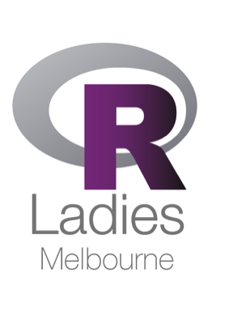

Events in 2016-2017
===================

-   [Launch Meetup](https://github.com/R-LadiesAU/Events-2017/tree/master/2016-10-18-Launch-Meetup)

-   [R Notebooks and Interactive Graphics](https://github.com/R-LadiesAU/Events-2017/tree/master/2017-02-20-LearnAboutRNotebooksAheatmapInteractiveGraphics)

-   [Git and GitHub workshop](https://github.com/R-LadiesAU/Events-2017/tree/master/2017-04-05-Git-Workshop)

-   [Twitter Workshop](https://github.com/R-LadiesAU/Events-2017/tree/master/2017-05-22-Twitter-Workshop)

-   [Web Scraping & Sports Analytics](https://github.com/R-LadiesAU/Events-2017/tree/master/2017-06-15-Web-Scraping)

-   [Build Neural Network with R](https://github.com/R-LadiesAU/Events-2017/tree/master/2017-07-17-BuildNeuralNetwork)

-   [mixOmics: Combine Large Scale Datasets](https://github.com/R-LadiesAU/Events-2017/tree/master/2017-08-22-combine-large-scale-dataset-workshop)

-   [Introduction to R Workshop](https://github.com/R-LadiesAU/Events-2017/tree/master/2017-09-23-Introduction_to_R_workshop)
